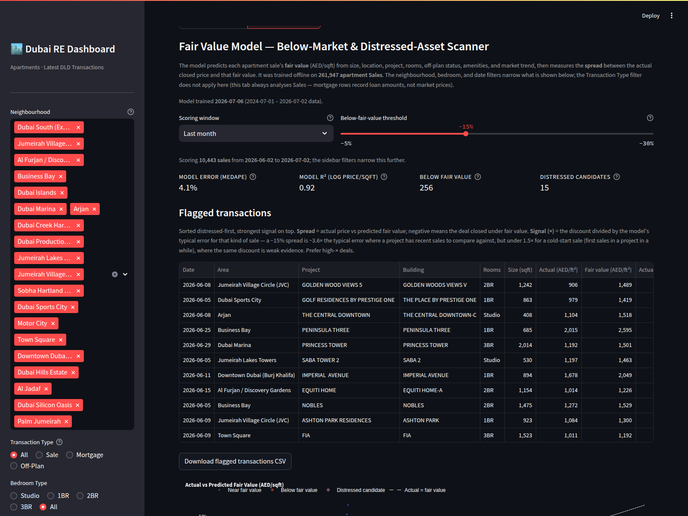
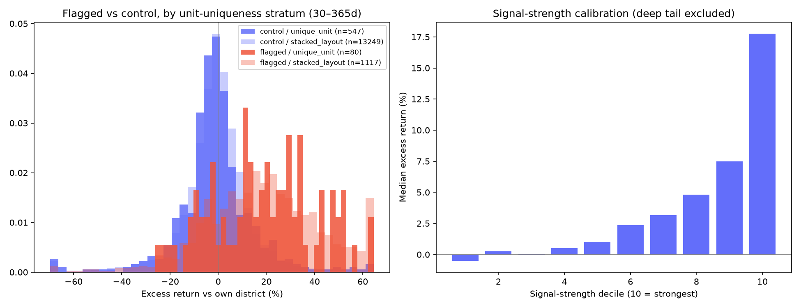
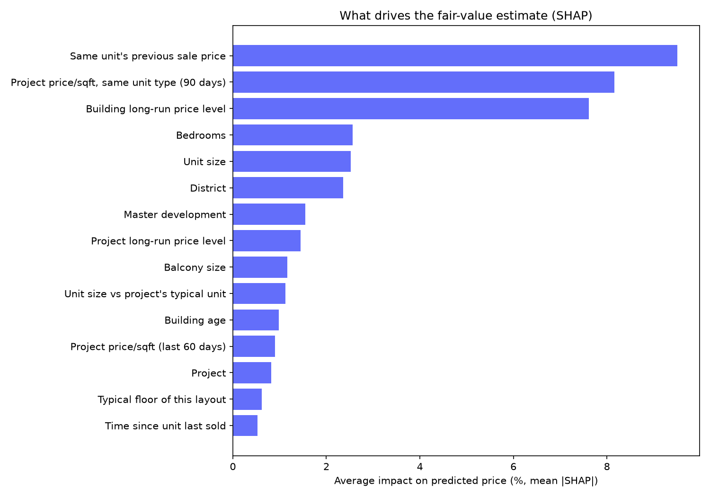
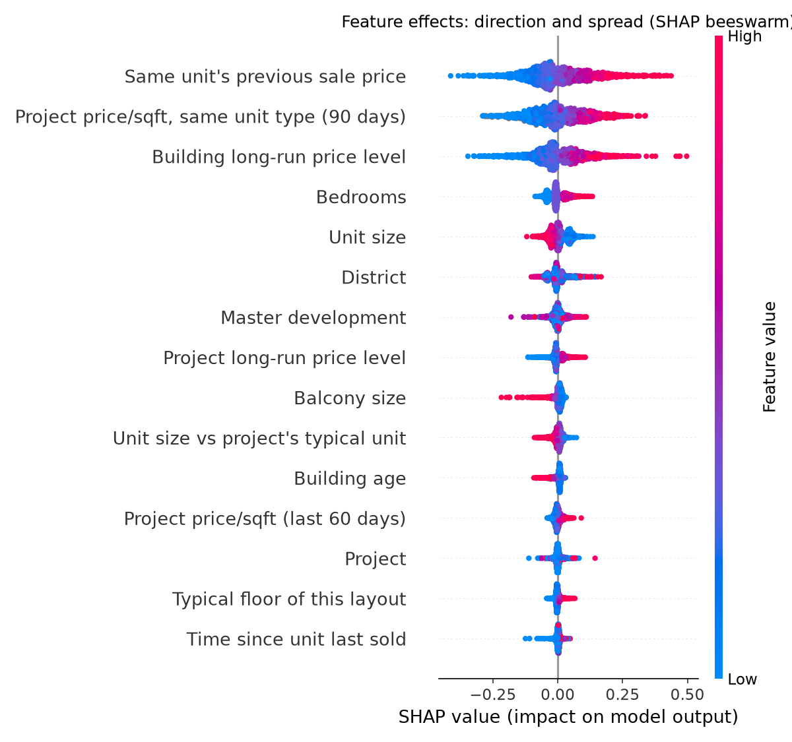
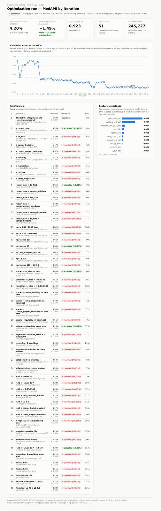
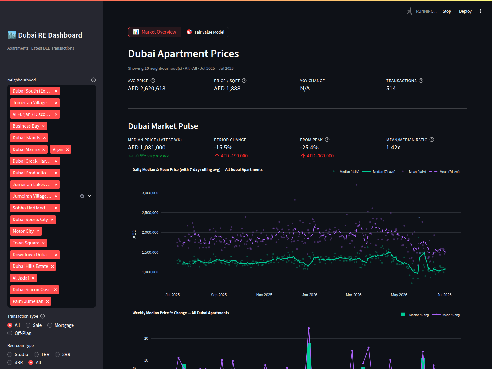

# Dubai Real Estate Dashboard — Underpriced & Distressed Deal Finder

A Streamlit dashboard over official Dubai Land Department (DLD) transaction
records with one product objective: **find good opportunities — apartments
that changed hands meaningfully below their fair market value**, rank them by
how strong the evidence is, and corroborate which of them look genuinely
distressed. A Market Overview page gives the city-wide price context; the
Fair Value Model page is the deal scanner.



## The approach

```mermaid
flowchart LR
    A[DLD Open Data API] -->|24-month snapshot,\nnever rewritten| B[(GCS raw Parquet)]
    B --> C[Data cleaning\nclassify / repair / route]
    C --> D[Feature engineering\nstrictly past-only]
    D --> E[Gradient-boosted\nfair-value model]
    E -->|offline training,\npublished bundle| F[(GCS model bundle)]
    F --> G[Dashboard scoring]
    G --> H[Spread = actual / fair − 1]
    H --> I[Flags + signal strength\n+ distress corroboration]
    I --> J[Human review UI\n+ CSV export]
```



1. **Ingest** — `ingestion/` pulls DLD transactions (24 months, ~323k rows)
   and reference datasets (projects, buildings, units registry, Ejari rents)
   into Google Cloud Storage. The raw snapshot is **never rewritten** with
   derived values; every downstream step runs from raw + code, so results are
   always reproducible and rules can evolve.
2. **Clean** — `model/data_cleaning.py` labels every sale
   `clean / repaired / review_only / quarantine` instead of silently dropping:
   digit-shift price typos are repaired against the project median sale
   price; bulk-deal allocations, suspected related-party token prices, and
   partial-ownership shares are routed to a labelled review queue (shown in
   the UI, never flagged as deals). Design follows IAAO sales-verification
   practice — see `reports/data_cleaning_research_report.md`.
3. **Model** — `model/fair_value_model.py` predicts each sale's fair value
   (log AED/sqft) with gradient-boosted trees from ~30 features: unit size
   and floor, project/building recent and long-run price levels, the unit's
   own previous sale, per-unit-type medians, district, developer, building
   age, off-plan status, market trend. Every history-based feature is
   **strictly past-only** (rolling windows closed on the left), so the model
   never peeks at the future or at the deal itself.
4. **Score & flag** — spread = actual price / predicted fair value − 1.
   Sales below the threshold (default −15%) are flagged; **signal strength**
   divides the discount by the model's typical error for that segment, so a
   −15% spread in a liquid project (~3.6× typical error) outranks the same
   discount on a cold-start sale (~1.5×). "Distressed candidate" additionally
   requires a residual-independent signal (forced-sale procedure keyword,
   illiquid project, multiple sellers) — a deep discount alone never
   qualifies.

## Methodology (how we know it works)

- **Validation**: 10-fold date-ordered `TimeSeriesSplit` — every fold trains
  on the past and is tested on the future. Improvements were accepted only on
  a MedAPE win **and** no worsening of tail metrics (P90 error, false-flag
  share), measured against a sequestered holdout used exactly once.
- **Outcome backtest** (walk-forward, no hindsight): models frozen quarterly,
  flags issued out-of-sample, outcomes tracked via same-unit resales. Flagged
  entries' discounts **close**: they enter at −19.8% spread and resell at
  +3.2% — the gap is real and captured at purchase. On registry-proven
  same-apartment pairs the buyer's realized edge over the district was
  **≈ +14%** (n=60, cluster-robust CI clear of zero). Full analysis:
  `reports/distress_validation_report.md`.
- **Data cleaning A/B** (measured before shipping): false-flag share
  4.16% vs 4.33%, tail P90 error 14.40% vs 14.68%, and the fake-discount
  deep tail (< −35%) down 24% out-of-sample. `reports/data_cleaning_report.md`.
- **Regime awareness**: a model frozen 4 months overstates fair value ≈1.1%
  in the current declining market — hence weekly retrains and a ±2% alarm on
  the live monthly median spread.

## Results

| Metric | Value |
|---|---|
| Cross-validated median error (MedAPE) | **4.08%** |
| One-shot sequestered holdout MedAPE | **4.15%** |
| Cold-start sales (~8% of rows) | ~6.5% error — flagged as such in the UI |
| Model R² (log price/sqft, out-of-time) | 0.92 |
| Realized edge of flagged deals, same-unit resales | **≈ +14%** vs district (30–183d holds) |
| Signal-strength ranking calibration | monotone: decile 10 → +17.8% excess return |

For context, industry AVMs report ~2% median error **with the asking price
as an anchor** and ~7% without; this model has no asking-price anchor.

**Outcome backtest** — flagged (red) vs control (grey) resale outcomes,
signal-strength calibration, and regime drift:



**What drives the fair value** (SHAP on the shipped model — the unit's own
sale history and project price levels dominate; time/trend matters little
because trailing medians already carry it):




**Accuracy campaign** — 110 tracked experiments across two optimization
campaigns (5.05% → 4.08% CV MedAPE):



## How to use the dashboard

Run locally (or use the Streamlit Cloud deployment):

```bash
pip install -r requirements.txt
python -m streamlit run dubai_dashboard.py
```

The app starts on http://localhost:8501. It needs `.streamlit/secrets.toml`
(see Setup below) to read the GCS snapshot and model bundle.

**Pages** — the segmented control at the top switches between:

1. **Market Overview** — city-wide context: headline KPIs, Dubai Market
   Pulse (median/mean daily prices, weekly momentum), and market-tier
   trends.

   

2. **Buyer Opportunity Scanner** — a below-median deal finder for one
   zone at a time:
   each transaction's AED/sqft against the zone's 14-day rolling median,
   an adjustable deal threshold, a ranked below-median deals table with
   CSV download, and deal counts across zones to guide which zone to open
   next. Loads only when this page is selected, keeping Market Overview
   fast.

3. **Rent Scanner** — the tenant-side twin, built from Ejari rental
   contracts (flats, annual **AED/sqft/yr**): windows of 3 months or less
   show individual contracts against the zone's 14-day rolling median rent
   with a ranked below-median deals table and CSV download; longer windows
   switch automatically to weekly box plots (median, q1–q3 box, p10–p90
   whiskers) from pre-aggregated stats, because Ejari volume dwarfs the
   sales feed. Renewal contracts (RERA rent-cap keeps them below market)
   are excluded by default. Requires the rents ingestion pull to have
   published its GCS artifacts.

4. **Fair Value Model** — the deal scanner (screenshot at the top):
   - **Sidebar filters** (shared with Overview): neighbourhoods, bedroom
     type, date range. The Transaction Type filter doesn't apply here — this
     page always analyses Sales.
   - **Scoring window**: how far back to score (default "Last month" keeps
     it fast). Features always use full history, so results are identical
     either way.
   - **Below-fair-value threshold** slider: how deep a discount must be to
     flag (default −15%).
   - **Flagged transactions table**, sorted distressed-first then by signal
     strength. Columns: Spread (% below fair value), **Actual and Fair value
     in both AED/ft² and total AED**, Signal (×) — the discount as a multiple
     of the model's typical error for that kind of sale (prefer high-×),
     Cold start (first sales in a project in a while — treat with care),
     Distressed + the corroborating signals. Download as CSV underneath.
   - **Actual vs fair value scatter** and **spread distribution** charts —
     flagged deals in red, distressed candidates in pink.
   - **Excluded suspicious records** expander: real transfers whose
     registered price isn't a market price (bulk allocations, token
     transfers), each with the price it sold at vs the **project median sale
     price (AED/ft²)** and the reason it was excluded. These are never
     flagged as deals and never hidden.
   - **Data & methodology** expander: plain-language explanation of the
     model, its accuracy, and every data source.

**Reading a flag**: a row with spread −18%, Signal 4.2×, Cold start = false,
Distressed = true means: the unit sold 18% under the model's fair value,
that gap is 4.2× the model's typical error for that segment (strong
evidence), the project has recent sales to compare against, and at least one
distress signal (e.g. multiple sellers) corroborates it. That's a candidate
worth human follow-up — the product wording is deliberately "below fair
value — corroborated", not proof of a forced sale.

## Repository layout

```
dubai_dashboard.py       # Streamlit entrypoint (Market Overview, Buyer Opportunity Scanner + page routing)
fair_value_tab.py        # Fair Value page UI
rent_scanner_tab.py      # Rent Opportunity Scanner page UI
dashboard_constants.py   # shared constants (areas, tiers, unit conversion)
ingestion/               # DLD API client, GCS storage, snapshot & reference pulls
model/                   # fair-value model, data cleaning, training, optimization, backtest
tests/                   # smoke tests (API, GCS, end-to-end model)
reports/                 # research & results reports with findings (+ figures/)
docs/                    # access notes, phase-3 plan
```

## Data & operations

```bash
# Refresh the 24-month GCS snapshot (incremental, verified)
python -m ingestion.store_dld_transactions_gcs

# Refresh reference datasets (projects/buildings/units; monthly is plenty)
python -m ingestion.store_reference_data_gcs --only projects buildings units

# Retrain offline and publish the inference bundle (weekly, after refresh)
python -m model.train_fair_value

# End-to-end smoke test (synthetic; run before touching model logic)
python -m tests.smoke_test_fair_value
```

The deployed app never trains — it loads the published bundle (6h cache).
Monitoring rules: retrain weekly (a 4-month-stale model overstates fair
values ≈1.1% in a falling market); alarm if the live monthly median spread
drifts beyond ±2% or cleaning counts jump (repairs > 0.2%, review > 2%).

## Reports index

| Report | What it contains |
|---|---|
| `reports/distress_validation_report.md` | Walk-forward outcome backtest of the flags |
| `reports/fair_value_optimization_report.md` | The 110-experiment accuracy campaign log |
| `reports/shap_insights_report.md` | SHAP analysis: drivers, insights, recommendations |
| `reports/data_cleaning_report.md` | Cleaning rules, real-data counts, enable decision |
| `reports/data_cleaning_research_report.md` | Industry best-practice review (IAAO, Land Registry…) |
| `reports/data_quality_report.md` | DLD snapshot audit (procedures, distributions) |
| `reports/features_research_report.md` | Home-price-driver research behind the feature groups |
| `reports/building_quality_research_report.md` | Building reviews / comfort research (Phase 3 input) |
| `docs/phase3_plan.md` | Planned: Google reviews, live listings (Bayut/dubizzle) |

## Setup

Keep secrets in `.streamlit/secrets.toml` locally and in Streamlit Cloud app
settings for deployment. Never commit secrets.

```toml
GCS_BUCKET = "dubai-real-estate-dashboard-jef"
GCS_TRANSACTIONS_OBJECT = "dld_transactions/dld_transactions_latest.parquet"
GCS_MODEL_OBJECT = "fair_value_model/fair_value_model_latest.pkl"

GCP_SERVICE_ACCOUNT_JSON = '''
{
  "paste": "the full downloaded service account JSON here"
}
'''
```

DDA API secrets are needed only for refreshing the snapshot / API fallback:

```toml
DDA_BASE_URL = "https://apis.data.dubai"
DDA_SECURITY_APPLICATION_IDENTIFIER = "..."
DDA_CLIENT_ID = "..."
DDA_CLIENT_SECRET = "..."
DDA_ENTITY = "dld"
DDA_DATASET = "dld_transactions-open-api"
DDA_VERIFY_SSL = true
```

GCS resources:

```text
Project: realstateproject
Bucket: dubai-real-estate-dashboard-jef (EU multi-region, uniform access, public access prevention on)
Service account: dubai-dashboard-gcs@realstateproject-500813.iam.gserviceaccount.com (Storage Object Admin)
```

Current snapshot: **323,170 rows, 24 months** (verified row count, columns,
dedup, and date coverage on every refresh).

## Commit safety

Commit code and docs only. Never commit `.streamlit/secrets.toml` or any
service-account JSON key.
